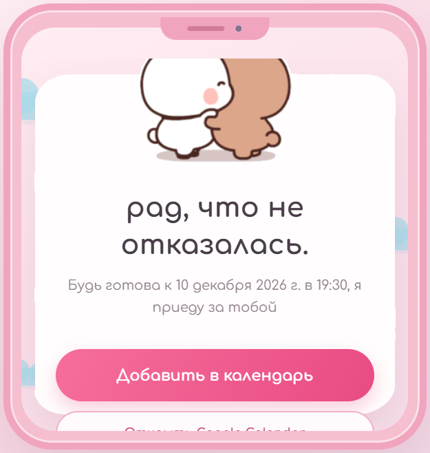

# Приглашение на свидание

Небольшой адаптивный сайт-приглашение. Работает как статическая страница: без сборки, базы данных и обязательного сервера. Подходит для GitHub Pages.

## Скриншоты

На финальном скриншоте показана демонстрационная дата, выбранная только для примера.

## Возможности

- Пошаговый сценарий приглашения с анимированными GIF-стикерами.
- Выбор даты, времени, места и угощения.
- Скачивание события `.ics` и ссылка для Google Calendar.
- Необязательное Telegram-уведомление через Google Apps Script.
- SVG-запаска для стикеров, если GIF не загрузилась.

## Запуск

Откройте `index.html` в браузере. Сборка и установка пакетов не требуются. Для шрифта Comfortaa и GIF-стикеров нужно подключение к интернету.

Дата и время по умолчанию задаются в полях `#date` и `#time` в `index.html`.

## Размещение на GitHub Pages

Инструкция находится в [ИНСТРУКЦИЯ.md](ИНСТРУКЦИЯ.md). Уведомления в Telegram выключены, пока не настроен вебхук.

## Важно о безопасности

Не добавляйте в публичный репозиторий токены Telegram, пароли, личные данные или файлы с секретами. Токен бота следует хранить в свойствах проекта Google Apps Script, а не в HTML.
